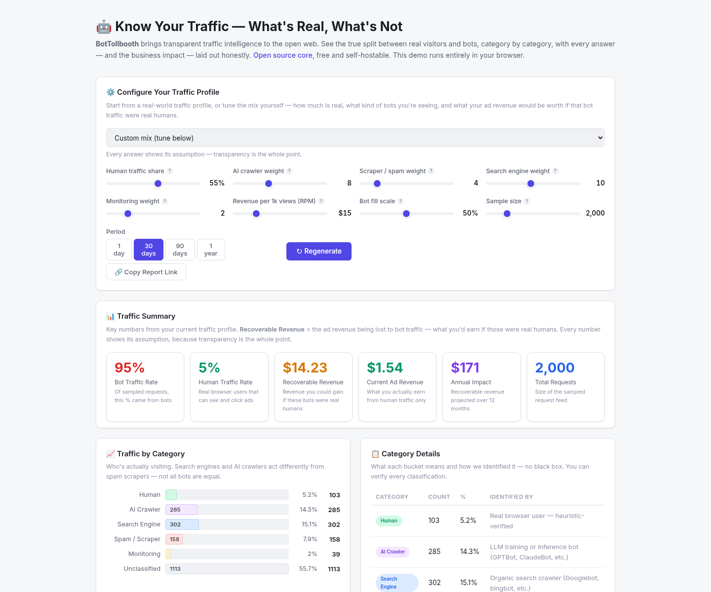

# BotTollbooth

**Separate the bots from the buyers.**

[](https://github.com/jweezy119/bottollbooth/actions/workflows/test.yml)
[](https://jweezy119.github.io/bottollbooth/)
[](LICENSE)
[]()
[]()

Every website owner deserves to know the truth about their traffic: who is
really visiting, what is a bot, and what is actually **driving business**
versus noise, waste, or fraud.

Enterprise platforms (DoubleVerify, Integral Ad Science) keep big publishers'
numbers honest. Small and mid-sized sites on Adsense, Mediavine, or their own
stack are stuck with opaque dashboards and inflated bot numbers they can't
act on — which quietly siphons ad revenue and distorts every marketing
decision.

BotTollbooth is the visibility layer for the rest of the internet:

- **Transparent** — every request is classified *and* shows the exact signal
  that produced the answer. No black box.
- **Honest** — revenue impact uses conservative, published assumptions, never
  marketing fluff.
- **Fair** — MIT core, runs anywhere, built for the site owners who are
  being overcharged for answers they should already have.

Zero runtime dependencies. One small engine. A demo, a CLI, an SDK, and a
self-hostable API that turn your own access logs into answers **and** into
regulatory deliverables (CoMP / EU AI-act robot policies and disclosures) —
including the **bandwidth cost** the AI crawlers quietly add to your hosting
bill, and a **browser probe** that flags headless shells by client signals
that access logs alone can't show.



---

## Try it now

[Open the interactive demo](https://jweezy119.github.io/bottollbooth/) — runs
entirely in your browser. Start from a real-world profile (Local Business,
E-commerce, Editorial) built on 2026 crawler data, tune the mix and RPM, and
live-update the panels:

1. **Traffic mix** — humans vs AI crawlers / search / monitors / spam.
2. **Crawl Purpose & Value Exchange** — how many visitors each crawl type
   actually returns (ClaudeBot ≈ 38,000:1, GPTBot ≈ 1,091:1, Google ≈ 5.4:1).
3. **Bandwidth & Cost Impact** — egress dollars the crawlers burn, with the
   AI-training share broken out separately.
4. **CoMP / EU Opt-out & Disclosure** — generated `robots.txt`, opt-out list,
   and NTM disclosure, copy-paste ready.
5. **Session Probe** — what the embeddable `probe.js` reports for *your* 
   browser (webdriver, software renderer, sensors).
6. **Revenue impact** — conservative, defensible ad-revenue estimates.
7. **Paste-a-URL Audit tab** — the client-side verdict shape for an external
   audit (sample data in the browser; live runs via `POST /api/v1/audit` on
   the self-hostable service).

**Download JSON Report** grabs the full dataset; **Copy Report Link**
reproduces the exact same dataset on any device (the link encodes the mix,
not a screenshot).

## Quick start (no install)

```bash
npm test                          # zero-dependency test suite
node examples/demo.js --rpm 15    # CLI report for a simulated site
```

No `npm install` is required anywhere in this repo — plain Node.js (>=18).

## Run the app (hosted dashboard + API)

```bash
BOTTOLLBOOTH_TOKEN=mysecret docker compose up --build
# open http://localhost:8080/app        — workspaces, live reports, audits
# open http://localhost:8080/audit      — paste-a-URL external audit
# API: http://localhost:8080/api/v1/... (Bearer token required)
```

The dashboard is a zero-dependency single page that talks to the service:
create a **workspace** (namespace), load sample traffic or send your real
log rows via `/api/v1/ingest`, read the live report (mix, value exchange,
bandwidth, compliance pack with sha256 digest), run an **external audit** on
any URL, and export JSON. Workspaces persist across restarts as JSON files
under `DATA_DIR` (default `data/service/`) — no database required.

## Use it as a library (SDK)

```js
const bt = require('./src/sdk');               // zero-dependency, in-repo

const { rows } = bt.parseLog(accessLogText);
const report = bt.score(rows, { rpm: 15 });   // summary + value exchange + bandwidth
console.log(report.bandwidth.bandwidthCostUSD);

const compliance = bt.compliance(report.crawlers);
console.log(compliance.robotsTxt);            // ready to deploy
```

## Score your real traffic (bring your own data)

```bash
node examples/accesslog-to-ingest.js access.log \
  --post http://localhost:8080 --namespace mysite.com

curl "http://localhost:8080/api/v1/report?namespace=mysite.com&rpm=15"
curl "http://localhost:8080/api/v1/compliance?namespace=mysite.com"
```

The importer parses Nginx/Apache combined-format logs, computes each client's
60-second burst rate, and pushes batches into the service. `site-report.js`
reads the same log directly and prints the full picture — or writes the
compliance artifacts to disk with `--write-dir`:

```bash
node examples/site-report.js access.log --namespace shop.example.com \
  --write-dir out/     # → robots.txt, opt-outs.json, disclosure.json/.txt
```

The report now includes the **bandwidth & cost impact** section (bot MB
delivered, egress cost, AI-training share) — assumptions adjustable with
`--page-kb` and `--cost-per-gb`.

## Deploy the API

```bash
docker build -t bottollbooth .
docker run -d --name bottollbooth -p 8080:8080 bottollbooth   # or: docker compose up -d
curl http://localhost:8080/health   # {"status":"ok"}
```

The container is a Node 22 Alpine image; the app process runs as a non-root
user (the entrypoint drops from root to the unprivileged `node` user after
making `DATA_DIR` writable), and carries a healthcheck. Set
`BOTTOLLBOOTH_TOKEN` to require
`Authorization: Bearer <token>` on every `/api/v1/*` endpoint (write and read
alike); `/health` and `/probe.js` stay open. Security headers (nosniff,
frame-deny, referrer policy) are applied to every response.
The dashboard is a static file (`index.html`) — it calls the same engine
in-browser with a CSP, so nothing else is needed to explore.

### Deploy to Fly.io (the frugal path)

[`fly.toml`](fly.toml) is ready for a single 256MB shared-CPU machine that
auto-stops when idle (scale-to-zero) so compute is near-free between visits,
with a 1GB volume keeping workspaces warm across restarts. Honest cost check
(2026): Fly has no free tier for new accounts — Pay-As-You-Go only, roughly
**$2/mo** if the machine never stops, **often under $1** with auto-stop, plus a
1GB volume at ~$0.15/mo and a few cents of egress.

```bash
flyctl auth login                     # browser login, first time only
flyctl launch --name bottollbooth --region iad --no-deploy   # creates the app
flyctl volumes create btb_data --region iad --size 1          # the 1GB store
flyctl secrets set BOTTOLLBOOTH_TOKEN=change-me-long-random   # gate the API
flyctl deploy
flyctl open                           # https://bottollbooth.fly.dev/app
```

`flyctl destroy` also deletes the app (and stops billing) when you're done.
If the name `bottollbooth` is taken, pick another in `flyctl launch --name`.

## HTTP API

| Endpoint | What it does |
| --- | --- |
| `POST /api/v1/ingest` | Accepts request rows (`userAgent`, burst rate) for the given `?namespace=` |
| `POST /api/v1/probe` | One headless/sensor signal from the browser probe (`{namespace, userAgent, signals}`) |
| `GET /api/v1/report?namespace=x&rpm=15` | Traffic mix, value exchange, bandwidth cost, revenue impact, sha256 digest |
| `GET /api/v1/compliance?namespace=x` | Generated `robots.txt`, opt-out list, CoMP/EU disclosure |
| `GET /api/v1/classify?ua=<user-agent>` | Live lookup → `category`, `confidence`, `signal` |
| `GET /api/v1/namespaces` | Workspace list + stored audits (powered by `src/service/store.js`) |
| `POST /api/v1/audit` | Ethical external site audit (`{url}`) → bots policy, WAF, security headers, egress cost, deployable opt-out block |
| `GET /audit` | Hosted "paste a URL" audit page (`audit.html`) |
| `GET /app` | Hosted workspace dashboard (`app.html`) |
| `GET /probe.js` | Embeddable browser probe (headless / sensor client signals) |
| `GET /health` | Liveness probe |

## Audit a site you don't control (`src/audit/`)

Paste any public URL at `GET /audit` (or run
`node examples/audit-cli.js https://example.com`) and BotTollbooth probes it
**like a respectful bot**: it fetches the target's `robots.txt`, then at most
one page — and only if the target's own robots.txt allows the audit agent. It
won't deface, won't fake an identity, and stops as soon as the site tells it
to. The verdict shapes what a public URL can honestly tell you:

- per-crawler `robots.txt` verdict (allowed / partial / blocked / unlisted)
  for GPTBot, ClaudeBot, CCBot, PerplexityBot, Google-Extended and friends
- WAF / CDN layer detection (Cloudflare, DataDome, CloudFront, Fastly, …)
- security-header hygiene and an overall grade
- one page-weight measurement extrapolated into a monthly egress cost window
- a deployable AI-crawler opt-out block

The scanner is SSRF-hardened: http(s) only, no credentials, ports 80/443,
and any DNS answer that resolves into a private / loopback / link-local /
CGNAT range is refused before a single byte is fetched — proven in the test
suite. Per-host throttling sits at the API layer.

## Headless & sensor detection (`src/probe/`)

Access logs can't see what's running in the browser. Embed
[`probe.js`](src/probe/probe.js) anywhere and it reports the client-side
signals that separate a human browser from a headless shell:

- `navigator.webdriver` (true if driven by ChromeDriver-style automation)
- WebGL renderer string resolved to a software fallback (SwiftShader /
  llvmpipe — headless, VMs, and CI)
- `navigator.plugins.length` (0 in a headless shell)
- Generic Sensor / Battery API presence

Those signals feed the same classifier — a probe-hit surfaces as
`probe:webdriver` / `probe:softwareRenderer`, the exact signal ready for
escalation, not a black-box ban.

## Architecture

```
  your access.log
        │  examples/accesslog-to-ingest.js  (parses + computes burst rate)
        ▼
  src/service      self-hostable Node API, zero dependencies
        ├─ POST /api/v1/ingest        ← store real requests per namespace
        ├─ GET  /api/v1/report        → mix · value exchange · revenue · digest
        ├─ GET  /api/v1/compliance    → CoMP/EU robots.txt + opt-outs + disclosure
        └─ GET  /api/v1/classify      → per-UA: category · confidence · signal
        ▲
        │  src/engine    pure functions, inlined 1:1 into the browser demo
        │                classify · purpose registry · digest · disclosure
```

The engine is a [src/engine/index.js](src/engine/index.js) single-purpose
module: explicit-priority user-agent signatures, then weighted behavioural
heuristics (headless hints, burst, zero dwell time) for bots that defeat
signature matching. Every answer returns **category, confidence, and its
source signal** — that transparency contract is the product.

Rollups feed a deliberately conservative revenue estimate
(`botVisitors / 1000 × rpm × fillScale`, fill scale defaults to 50% and is
user-adjustable). SMB owners get a defensible number instead of a scare.

## Verification

- **Zero-dependency test suite** (`npm test`) covers the engine, the log
  importer, the service pipeline, and the inlined browser demo.
- **CI** runs every commit through the tests, the full CLI end-to-end path
  (importer → report → compliance artifacts), and a real container smoke
  test with readiness polling — [see the workflow](.github/workflows/test.yml).
- **Tamper evidence** — every report carries a deterministic sha256 digest of
  the canonical JSON; tampering is detected by construction (and tested).
- The crawler registry encodes **published 2026 crawl-to-referral ratios**,
  so value-exchange claims are grounded in cited data, not vibes.

## What this showcases

| Skill | Where it lives |
| --- | --- |
| **API & data integration** | `src/service/`, `src/sdk/` — ingest pipeline, aggregation, HTTP API + zero-dependency client SDK |
| **Identity & classification** | `src/engine/` — "who is this request, is it real, how confident are we" applied to web traffic |
| **Applied AI / regulatory engineering** | CoMP + EU AI-act compliance layer: robots.txt, opt-outs, tamper-evident NTM disclosure from raw logs |
| **Security-minded tooling** | token-gated API, security headers, CSP demo, deterministic report digests, non-root container |
| **Browser-telemetry engineering** | `src/probe/` — headless / sensor client-signal collection into the same transparent classifier |
| **Ethical scanning / SSRF-safe crawler** | `src/audit/` — robots-respecting external audit: per-crawler bots policy, WAF/security headers, egress cost, deployable opt-out |
| **Product & B2B framing** | hosted workspace dashboard (`app.html`), persistence layer, bandwidth-cost + revenue-impact modelling, pricing tiers, docs for non-technical owners ([docs/monetization.md](docs/monetization.md)) |
| **Documentation & strategy** | [docs/architecture.md](docs/architecture.md), [docs/strategy.md](docs/strategy.md) — competition, north stars, web3 roadmap |

## Project docs

- [docs/architecture.md](docs/architecture.md) — how the product is built and deployed
- [docs/monetization.md](docs/monetization.md) — the honest, fair-pricing business model
- [docs/strategy.md](docs/strategy.md) — competition analysis, north stars, web3 feasibility

## Roadmap (what's next)

- **Deploy the app somewhere real** — the service + dashboard are deployed on
  a host; see the Fly.io path above (or a one-click button for a friendlier
  option).
- **Signed, anchorable reports** — SAS-verified digests so a report can be
  notarized over time (strategy Tier 1).
- **Crawler/agent identity registry** — credentialed identities for the
  purpose metadata, opening an app-store-style trust layer.
- **Hardened multi-tenant service** — the `$9`/`$79` tiers suggested on the
  demo: hosted ingest + probe endpoint, token-protected API, and white-label
  agency reports.

## License & author

MIT — see [`LICENSE`](LICENSE).

Built by [Syed Jawad Hussain](https://github.com/jweezy119). Feedback,
issues, and pull requests are welcome.